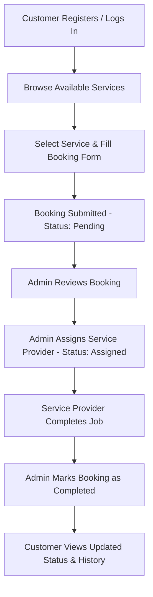

<div align="center">

# 🏠 HomeFix
### A Web-Based Home Service Management System

*Simplifying how customers book and track home maintenance services.*


## 📚 Table of Contents

<table>
<tr>
<td valign="top" width="50%">

**🧭 Getting Started**
- [👥 Team Information](#-team-information)
- [🔎 Project Overview](#-project-overview)
- [🎯 Project Objectives](#-project-objectives)
- [🗂️ Project Planning](#-project-planning)

**⚙️ System Details**
- [✨ System Features](#-system-features)
- [🧰 Service Categories](#-service-categories)
- [🔄 System Workflow](#-system-workflow)
- [🗄️ Database Design](#-database-design)
- [📐 System Diagrams](#-system-diagrams)

</td>
<td valign="top" width="50%">

**📈 Planning & Budget**
- [🗓️ Project Timeline](#-project-timeline)
- [📊 Gantt Chart](#-gantt-chart)
- [💰 Budget Summary](#-budget-summary)

**🚀 Build & Deploy**
- [🧱 Technology Stack](#-technology-stack)
- [📁 Project Structure](#-project-structure)
- [🖼️ UI Design / Screenshots](#-ui-design--screenshots)
- [⚙️ Installation Guide](#-installation-guide)

**📌 Wrap-Up**
- [🌱 Future Improvements](#-future-improvements)
- [📄 License](#-license)
- [📬 Contact](#-contact)

</td>
</tr>
</table>
---

## 👥 Team Information

**Group Name:** Team HomeFix

| SL No | Member Name | Student ID |
|:---:|---|:---:|
| 01 | Istiak Ahamed | 2024100000273 |
| 02 | MD. Shahedur Rahman Sajid | 2023100000589 |
| 03 | Mir Nafiul Islam Nirjhor | 2023100000599 |

---

## 🔎HomeFix Project Idea

**HomeFix** is a web-based Home Service Management System developed to simplify the process of booking and managing home maintenance services. The system allows customers to register, log in, browse available services, and submit service requests online.

Customers can book services such as **Electrician, Plumber, AC Repair, Carpenter, and Home Cleaning** by providing their address, phone number, preferred service date, and problem description.

The administrator manages customers, service providers, service categories, and booking requests. After receiving a booking, the administrator assigns an available service provider and updates the booking status from **Pending → Assigned → Completed**.

The system provides a centralized platform that improves service management, reduces manual work, and enables customers to track the status and history of their bookings.

---

## 🎯 Project Objectives

- Provide customers with a centralized platform to browse and book home maintenance services online.
- Eliminate manual, informal service coordination between customers and service providers.
- Allow administrators to efficiently manage customers, service providers, and service categories.
- Enable transparent tracking of booking status (**Pending → Assigned → Completed**).
- Maintain a searchable history of past bookings for customers.

---

## 🗂️ Project Planning

HomeFix was planned around a structured Software Development Life Cycle (SDLC), progressing through Planning, Analysis, Design, Implementation, Testing, and Deployment phases. Details of the time allocation for each phase are outlined in the [Project Timeline](#-project-timeline) section.

---

## ✨ System Features

<details open>
<summary><strong>👤 Customer Features</strong></summary>

- Register
- Login
- View available services
- Book a service
- Fill booking form:
  - Address
  - Phone number
  - Preferred service date
  - Problem description
- View booking status (**Pending, Assigned, Completed**)
- View booking history

</details>

<details open>
<summary><strong>🛠️ Admin Features</strong></summary>

- Login
- Manage customers
- Manage service providers (add, update, delete)
- Manage service categories
- View all bookings
- View booking details
- Assign a service provider to a booking
- View customer details
- View assigned bookings
- Update booking status (**Pending → Assigned → Completed**)
- Mark service as completed

</details>

---

## 🧰 Service Categories

| Category | Icon |
|---|:---:|
| Electrician | ⚡ |
| Plumber | 🚿 |
| AC Repair | ❄️ |
| Carpenter | 🪚 |
| Home Cleaning | 🧹 |

---

## 🗓️ Project Timeline

| Task | Start Time | Finish Time | Duration (Days) |
|---|:---:|:---:|:---:|
| Planning | 7/8/26 | 7/27/26 | 19 |
| Analysis | 7/27/26 | 8/10/26 | 14 |
| Design | 8/10/26 | 8/20/26 | 10 |
| Implementation | 8/20/26 | 8/27/26 | 7 |
| Testing | 8/25/26 | 8/30/26 | 5 |
| Deployment | 8/30/26 | 9/3/26 | 4 |

---

## 📊 Gantt Chart

> 📌 *Placeholder: insert the Gantt chart image here (e.g., `docs/gantt-chart.png`).*

```markdown

```

---

## 💰 Budget Summary

| Criteria | Subtotal Cost (USD) | Cost Percentage (%) |
|---|---:|---:|
| Personnel Cost | 22,800 | 65.14 |
| Infrastructure & Software Cost | 5,000 | 14.29 |
| Testing & Deployment Cost | 3,000 | 8.57 |
| Maintenance Cost | 4,200 | 12.00 |
| **Total Cost** | **35,000** | **100** |

> 📌 *Full itemized budget breakdown (personnel roles, testing costs, maintenance costs) is available in the project's Budget Preparation document.*

---

## 🧱 Technology Stack

> 📌 *Placeholder: technology decisions have not been finalized yet.*

| Layer | Technology |
|---|---|
| Frontend | To be decided |
| Backend | To be decided |
| Database | To be decided |
| Authentication | To be decided |
| Version Control | Git & GitHub |
| Deployment | To be decided |

---

## 🔄 System Workflow



---

## 📁 Project Structure

> 📌 *Placeholder: proposed structure — subject to change once implementation begins.*

```
HomeFix/
├── client/                     # Frontend application
│   ├── src/
│   │   ├── pages/
│   │   │   ├── customer/
│   │   │   └── admin/
│   │   ├── components/
│   │   └── services/
│   └── package.json
│
├── server/                     # Backend application
│   ├── controllers/
│   ├── models/
│   ├── routes/
│   └── config/
│
├── database/                   # Database scripts / schema
│   └── schema.sql
│
├── docs/                       # Documentation, diagrams, screenshots
│
├── .gitignore
├── LICENSE
└── README.md
```

---

## 🗄️ Database Design

> 📌 *Placeholder: detailed schema (tables, fields, relationships) to be added once database design is finalized.*

Expected core entities based on system features: **Customer**, **Admin**, **Service Provider**, **Service Category**, and **Booking**.

---

## 📐 System Diagrams

> 📌 *Placeholders: diagrams below will be added as system design progresses.*

<details>
<summary><strong>Use Case Diagram</strong></summary>

📌 *To be added — `docs/diagrams/use-case-diagram.png`*

</details>

<details>
<summary><strong>Activity Diagram</strong></summary>

📌 *To be added — `docs/diagrams/activity-diagram.png`*

</details>

<details>
<summary><strong>Sequence Diagram</strong></summary>

📌 *To be added — `docs/diagrams/sequence-diagram.png`*

</details>

<details>
<summary><strong>Class Diagram</strong></summary>

📌 *To be added — `docs/diagrams/class-diagram.png`*

</details>

<details>
<summary><strong>ER Diagram</strong></summary>

📌 *To be added — `docs/diagrams/er-diagram.png`*

</details>

<details>
<summary><strong>DFD (Data Flow Diagram)</strong></summary>

📌 *To be added — `docs/diagrams/dfd.png`*

</details>

---

## 🖼️ UI Design / Screenshots

> 📌 *Placeholder: screenshots will be added once the UI is developed.*

| Page | Preview |
|---|---|
| Customer Dashboard | `[placeholder]` |
| Booking Form | `[placeholder]` |
| Admin Dashboard | `[placeholder]` |
| Booking Management | `[placeholder]` |

---

## ⚙️ Installation Guide

> 📌 *Placeholder: setup steps will be finalized once the technology stack is decided.*

```bash
# 1. Clone the repository
git clone https://github.com/<your-username>/HomeFix.git

# 2. Navigate into the project directory
cd HomeFix

# 3. Install dependencies
# [command depends on chosen tech stack]

# 4. Run the application
# [command depends on chosen tech stack]
```

---

## 🚀 Future Improvements

- 📱 Dedicated mobile application
- 💳 Online payment integration
- ⭐ Customer ratings and reviews for service providers
- 🔔 Real-time notifications (email/SMS)
- 📍 Location-based provider matching

---

## 📄 License

This project is licensed under the **MIT License**. See the [LICENSE](./LICENSE) file for details.

---

## 📬 Contact

For questions regarding this project, please reach out to any of the team members listed in [Team Information](#-team-information) via university contact channels.

<div align="center">

**HomeFix** — Making home maintenance simple. 🏠

</div>
